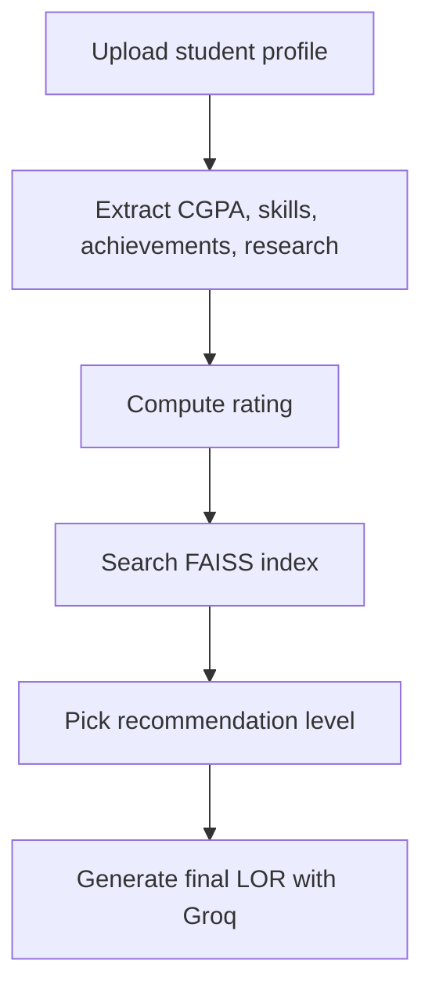

# 📝 Recommendation Letter Generator RAG Model

<div align="center">


<br />


</div>

## ✨ Overview

This project analyzes student information, retrieves the closest matching recommendation-letter template with **FAISS + sentence embeddings**, and generates a tailored letter using **Groq-hosted Llama models**.

---

## 🎯 What this app does

<table>
<tr>
<td width="50%">

### 📥 Input
- Upload a `.txt` file with student details
- Review extracted information directly in the app
- Choose the recommendation intensity

</td>
<td width="50%">

### 🤖 AI Pipeline
- Score student profile signals
- Retrieve the best template from FAISS
- Generate a polished LOR with an LLM

</td>
</tr>
</table>

---

## 🚀 Features

<div align="center">

| 📄 Upload | 🧠 Score | 🔎 Retrieve | ✍️ Generate | 📥 Download |
|---|---|---|---|---|
| Student profile input | Signal-based rating | Template similarity search | Formal LOR generation | Save output as text |

</div>

---

## 🧩 How it works



> If GitHub does not render Mermaid in your view, this flow is: **Upload → Analyze → Retrieve → Generate → Download**.

---

## 🖼️ Visual preview

<div align="center">


</div>

> Replace the image above with your real app screenshot after adding `assets/app-preview.png`.

---

## 🏗️ Project structure

```text
Recommendation-Letter-Generator-RAG-Model-
├── main.py
├── lor_indexer.py
├── lor_generator.py
├── sample_lor.json
├── config.py
└── README.md
```

---

## 🛠️ Setup

### 1) Create a virtual environment

```bash
python -m venv .venv
source .venv/bin/activate  # macOS/Linux
.venv\Scripts\activate     # Windows
```

### 2) Install dependencies

```bash
pip install -r requirements.txt
```

### 3) Configure your Groq API key

Set your key as an environment variable:

```bash
export GROQ_API_KEY="your_key_here"
```

On Windows PowerShell:

```powershell
$env:GROQ_API_KEY="your_key_here"
```

### 4) Run the app

```bash
streamlit run main.py
```

---

## 📌 Example input format

```text
Name: John Doe
CGPA: 3.92
Achievements: Dean's list, hackathon winner
Skills: Python, NLP, machine learning
Research: Undergraduate research assistant in AI
```

---

## 🔮 Suggested improvements

- Add a real screenshot to `assets/app-preview.png`
- Add a GIF demo section
- Add a sidebar with tips and sample prompts
- Add PDF/DOCX export for generated letters
- Add tests for scoring and retrieval logic
- Add a modern theme and better spacing in Streamlit

---

## 🛡️ Security note

Do **not** commit API keys to the repository. Rotate any exposed keys immediately and use environment variables or secret managers instead.

---

## 📄 License

Add a license file if you plan to share or reuse this project publicly.
